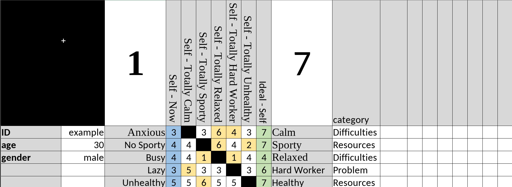

```{r, include = FALSE}
knitr::opts_chunk$set(
  collapse = TRUE,
  comment = "#>"
)
```

## Introduction

The core foundation of the `WimpTools` package is the `wimp` object. Unlike traditional repertory grids, a Weighted Implication Grid (WimpGrid) asks individuals to evaluate how changes in one construct would hypothetically impact all other constructs. This generates a dense, directed network of psychological implications. 

Before running any centralities, adjustment indices, or simulations, you must bring this data into R and transform it into a network-ready format. This vignette explains in detail how to use the specific `importwimp()` function to achieve this.

## The `importwimp()` Function

The `importwimp()` function is the single entry point for data ingestion in `WimpTools`. It reads a highly structured Excel file (`.xlsx`), standardizes all scores into a $[-1, 1]$ range, calculates directed implication weight matrices, and constructs the nodes and edges required for graph analysis.

### Usage

```{r usage_example, eval=FALSE}
library(WimpTools)
# Importing a typical WimpGrid file from the first sheet
example_wimp <- importwimp(path = "path/to/my_data.xlsx", sheet = 1)
```

For the remainder of the package documentation, we will use the built-in `example_wimp` dataset:
```{r, eval=TRUE}
data(example_wimp)
```

### Arguments

* **`path`** (`character`): A string containing the absolute or relative path to the Excel file. The file suffix must explicitly be `.xlsx`.
* **`sheet`** (`numeric` or `character`): Indicates which Excel sheet contains the WimpGrid data. It defaults to `1`. If you have multiple patients/grids in one workbook, you can iterate over this argument.

## Preparing the Excel File

```{r, echo=FALSE, out.width="100%", fig.cap="Excel Template Structure"}
# RMarkdown will run from the 'vignettes' directory during compilation

```

The algorithm within `importwimp()` relies completely on strict positional indexing of the Excel rows and columns. Consequently, your `.xlsx` file must adhere exactly to the following structure:

### 1. Global Metadata (Columns 1 & 2)
Starting from Row 2, the first two columns should be reserved for global metadata (key-value pairs) about the grid or the patient (e.g., `Age` in Column 1, `25` in Column 2; `Gender` in Column 1, `Female` in Column 2).

### 2. Scale Definition (Row 1)
The algorithm needs to know the absolute minimum and maximum possible scores of the scale used during grid administration to perform the normalization algorithm.

* **Minimum Value**: Must be located in Row 1, Column 3.

* **Maximum Value**: Must be located in Row 1, in the column immediately following the `Ideal Ratings`.

### 3. Construct Data (Rows 2 to N+1)
Assuming you have $N$ constructs, the data occupies rows $2$ to $N+1$.

* **Left Poles**: Column 3. The textual label for the left extreme of the construct.

* **Self Ratings**: Column 4. The individual's current "Actual Self" rating on the scale.

* **Hypothetical Matrix**: A square block of columns (from Column 5 to $5 + N - 1$). These columns represent the answers to the question: "If you were to fully move to the Right Pole of Construct $X$ (column), where would you be on Construct $Y$ (row)?"

* **Ideal Ratings**: The single column immediately following the hypothetical matrix block. Indicates where the individual would ideally like to be.

* **Right Poles**: The single column immediately following the Ideal Ratings.

* **Maximum Scale Value**: The column immediately following the Right Poles on row 1 (as established in Step 2).

* **Extra Attributes (Optional)**: Any columns added *after* the maximum scale value will be automatically digested as additional node variables (e.g., "Category", "Preference", "Symptom Status"). Note: If an extra attribute is explicitly named `Preference`, the function will automatically normalize it using the same $[-1, 1]$ scaling applied to the self and ideal scores.

## Under the Hood: The Normalization Algorithm

What exactly happens when `importwimp()` is called? The function runs several crucial mathematical transformations:

### 1. Score Normalization to $[-1, 1]$
Personal Construct Psychology often uses variable Likert scales (e.g., 1 to 7, 0 to 100). `importwimp()` identifies the scale's `center` (Midpoint) and standardizes all `self`, `ideal`, and `hypothetical` ratings to a $[-1, 1]$ continuous range. 

* A score of $-1$ perfectly aligns with the Left Pole.

* A score of $1$ perfectly aligns with the Right Pole.

* A score of $0$ indicates dead center.

### 2. Congruence Classification
The algorithm evaluates the mathematical sign of the `self` and `ideal` normalized ratings to assign one of four psychological classifications to each construct:

* **`Congruent`**: `sign(self) == sign(ideal)`. The individual is currently on the same side of the construct as they ideally want to be.

* **`Discrepant`**: `sign(self) != sign(ideal)`. The individual is on the opposite side of where they want to be.

* **`Dilemmatic`**: The `ideal` rating is exactly $0$ or missing (`NA`). The individual does not clearly prefer either pole.

* **`Undefined`**: The `self` rating is exactly $0$ or missing (`NA`).

### 3. Edge Weight Isolation (Implication Weights)
The raw hypothetical matrix contains absolute positional coordinates. To determine *implication* (i.e., how much movement on one construct causes movement on another), the algorithm subtracts the baseline `self` values. The mathematical formula normalizes the numerator (hypothetical position minus actual self) by the denominator (maximum hypothetical capacity to move) to generate a standardized `weight_matrix`. Diagonal values (self-loops) are calculated but eventually removed when constructing the formal edge data frame.

## The Output: The `wimp` Object Structure

The final output is an S3 object with classes `wimp` and `list`. It serves as the foundational data framework required by all downstream analysis functions in `WimpTools`. It contains three primary nested elements:

### 1. `my_wimp$global`
This list stores grid-level attributes rather than node-level properties:

* `scale`: A numeric vector `c(min, max)` containing the unnormalized scale limits.

* `n_constructs`: Numeric scalar indicating the number of constructs $N$.

* `weight_matrix`: An $N \times N$ matrix containing the standardized directed implication weights between constructs. Construct names serve as row and column names.

* `hypo_matrix`: An $N \times N$ matrix detailing the normalized hypothetical endpoints scenarios.

* **All Metadata**: Any custom metadata key-value pairs assigned in Columns 1 and 2 of the Excel file (e.g., `my_wimp$global$Age`).

### 2. `my_wimp$vertices`
A `data.frame` detailing all node properties. It possesses exactly $N$ rows.

* `id`: Numeric index matching the construct row.

* `left_pole`, `right_pole`: The textual strings for both poles.

* `self`, `ideal`: The mathematically normalized $[-1, 1]$ ratings.

* `self_pole`, `ideal_pole`: The textual labels of the pole nearest to the rating.

* `congruence`: Character classification (`Congruent`, `Discrepant`, `Dilemmatic`, `Undefined`).

* **Custom Attributes**: Columns corresponding to any extra data provided in the far-right of the Excel file.

### 3. `my_wimp$edges`
A highly filtered `data.frame` mapping the implication network as directed edges. Ready to be passed to network packages like `igraph` or `visNetwork`.

* `from`: The numeric `id` of the construct acting as the source of the implication.

* `to`: The numeric `id` of the receiving construct.

* `weight`: The standardized implication magnitude.

---
**Next Step:** Now that your WimpGrid data is securely transformed into a `wimp` object, you are ready to execute topological analyses. Check out the **Centrality and Structure** vignette for more information on indices.
